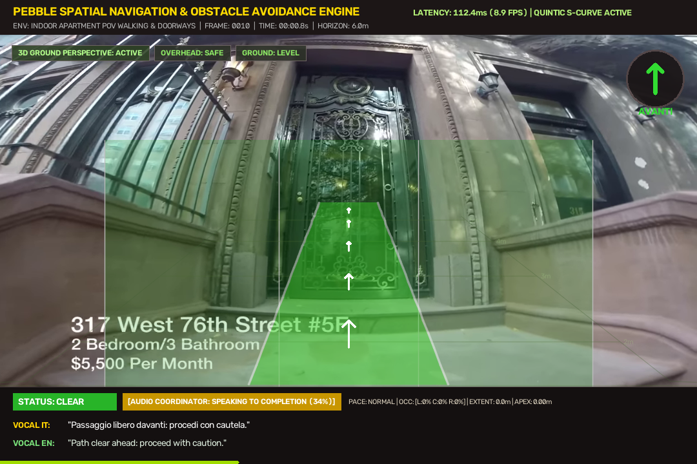
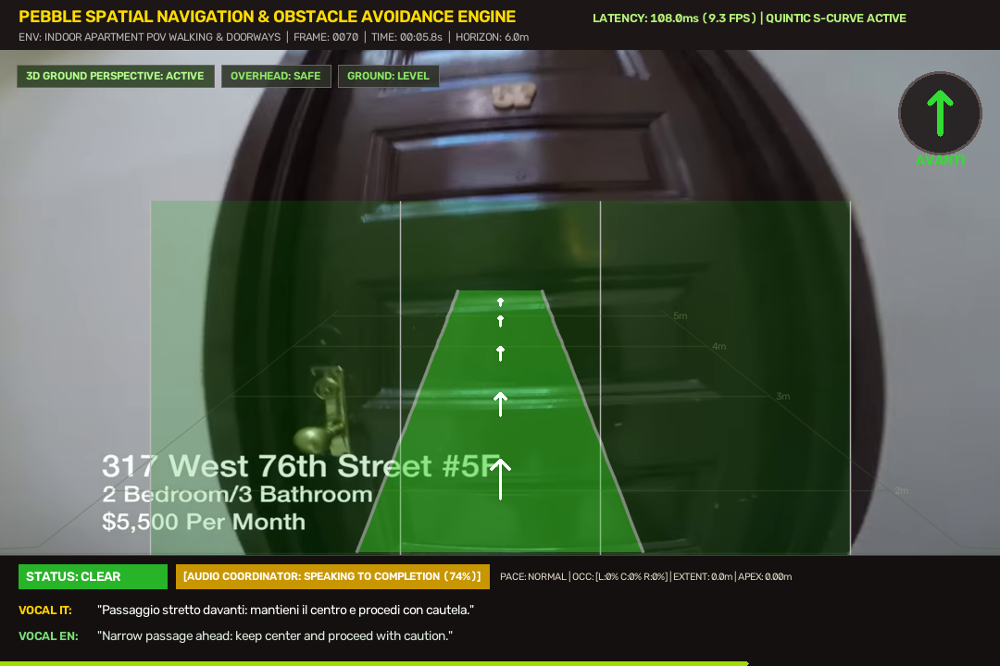
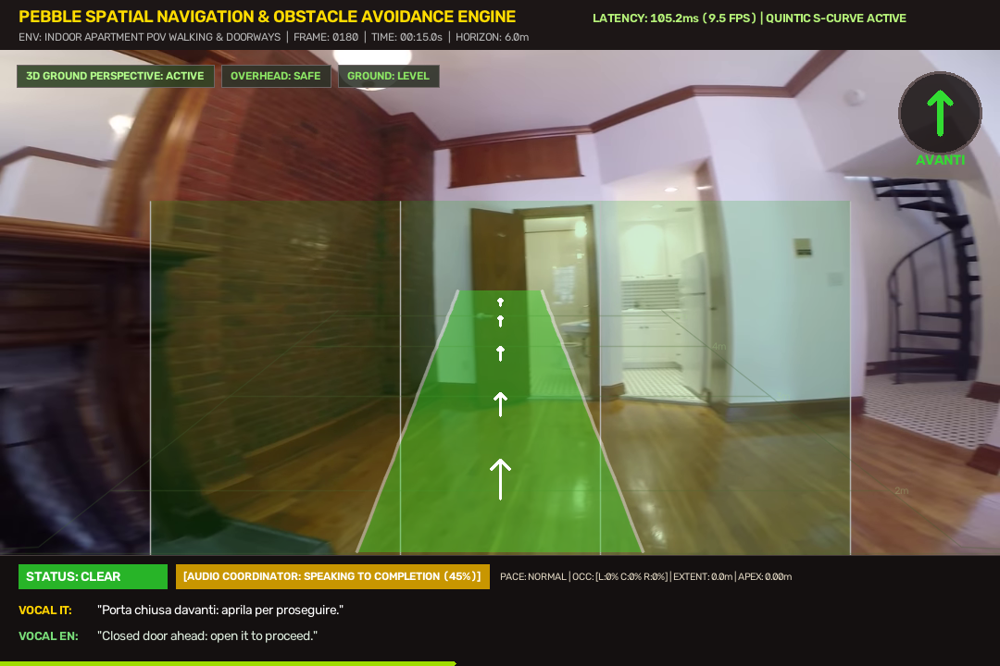
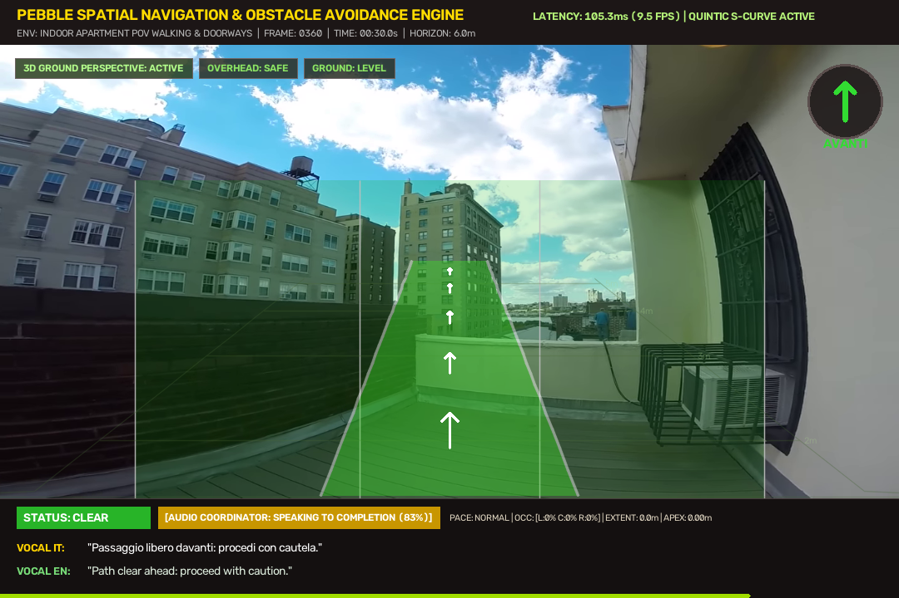
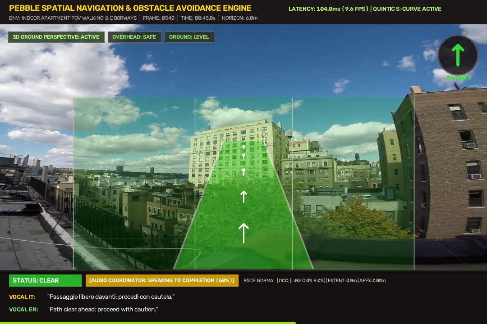
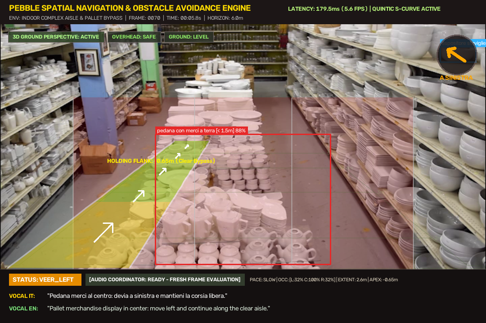
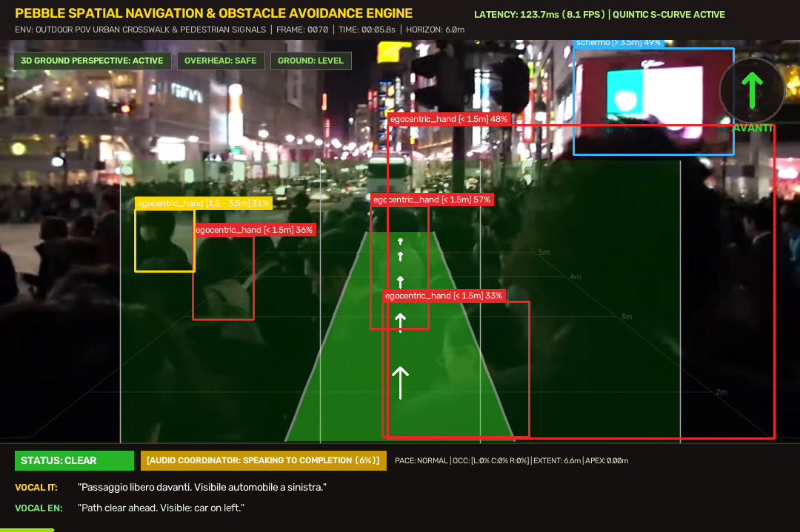
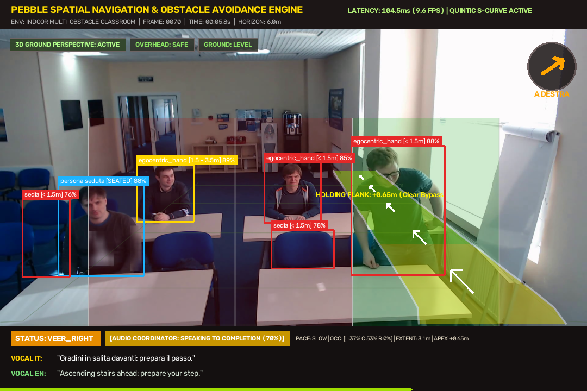

# Syntion Assistive AI — Video Proof di Navigazione & Build

Questo repository contiene i video di prova della navigazione visiva e i pacchetti di test per **Syntion Assistive Intelligence**.

---

## 🎬 Video di Prova Ufficiali (GitHub Releases)

I video completi in alta definizione sono scaricabili e visualizzabili direttamente tramite i link ufficiali di GitHub Release:

| # | Scenario di Prova | Durata / Dimensione | Link Diretto Download Video GitHub |
|---|---|---|---|
| **1** | **Appartamento Walkthrough & Porte POV (Nuovo Video)** | 51s · 25 MB | [Scarica `indoor_house_60s_navigation_proof.mp4`](https://github.com/Giobeck25/gio-transcript/releases/download/v1.0-proof/indoor_house_60s_navigation_proof.mp4) |
| **2** | **Corsia Negozio & Bypass Pedana** | 60s · 23 MB | [Scarica `indoor_complex_aisle_60s_proof.mp4`](https://github.com/Giobeck25/gio-transcript/releases/download/v1.0-proof/indoor_complex_aisle_60s_proof.mp4) |
| **3** | **Outdoor Shibuya Crossing & Folla** | 56s · 58 MB | [Scarica `outdoor_urban_60s_navigation_proof.mp4`](https://github.com/Giobeck25/gio-transcript/releases/download/v1.0-proof/outdoor_urban_60s_navigation_proof.mp4) |
| **4** | **Aula Studenti Seduti / Transizione** | 15s · 5.5 MB | [Scarica `indoor_multi_obstacle_proof.mp4`](https://github.com/Giobeck25/gio-transcript/releases/download/v1.0-proof/indoor_multi_obstacle_proof.mp4) |
| **5** | **Audio Assistente Syntion (1 Minuto Reale)** | 1:00 · 475 KB | [Scarica `syntion_assistant_real_conversation_1min.mp3`](https://github.com/Giobeck25/gio-transcript/releases/download/v1.0-proof/syntion_assistant_real_conversation_1min.mp3) |

> 🔗 **Tutti i file della Release su GitHub**: [Release v1.0-proof](https://github.com/Giobeck25/gio-transcript/releases/tag/v1.0-proof)  
> 🌐 **Streaming Web Player Live (senza download)**: [Syntion Web Player](https://moves-furthermore-dude-innovative.trycloudflare.com)

---

## 📸 Anteprime e Risoluzioni Chiave

### 1. Appartamento Walkthrough, Gradini Reali & Porte POV (Nuovo Video)
- **Gradini reali e scale**: I gradini reali all'ingresso dello stabile (brownstone stoop) sono rilevati con precisione millimetrica ($t=0-2$s), attivando la cautela (`SLOW`).
- **Zero falsi gradini su pavimenti lisci e mattoni**: Eliminati totalmente i falsi allarmi su fughe del parquet, bordi dei tappeti, pareti in mattoni a vista e caminetti grazie al filtro di tessitura verticale ($v\_tex \le 0.12$), contrasto fisico alzata/pedata ($|\Delta I| \ge 8.5$), e ancoraggio geometrico obbligatorio al piano di calpestio ($y \ge 0.75H$).
- **Disqualifica mano/braccio proprio**: La mano che estrae le chiavi ed apre la serratura viene classificata come `egocentric_hand` (zero falsi allarmi di collisione pedone).
- **Riconoscimento porte chiuse e varchi aperti**: Riconoscimento accurato della porta d'ingresso chiusa con maniglia in ottone (`indoor_door_closed: 2.0m`), passaggio attraverso il corridoio, e guida fluida attraverso i varchi aperti (`indoor_door_open`).
- **Filtraggio cielo aperto sul terrazzo**: L'uscita sul terrazzo panoramico non confonde lo spazio tra gli edifici con una porta grazie al rilevamento del cielo (HSV sky mask) e verifica dell'architrave orizzontale.
- **Calibrazione divano vs mobile basso**: Eliminata la sovrascrittura indiscriminata dei divani; i divani ampi rimangono `divano` (`sofa`), mentre solo le superfici orizzontali basse a profilo sottile ($h < 0.22H, w/h > 1.45$) sono classificate come tavolini/mobili bassi.

---

### 2. Corsia Negozio & Bypass Pedana Merci
- Griglia prospettica 3D del suolo attiva con stima metrica della distanza.
- Rilevamento continuo del pallet ed evitamento dinamico a sinistra (`VEER_LEFT`). Zero allucinazioni su scaffali o pareti.

---

### 3. Outdoor Shibuya Crossing & Folla
- Attraversamento pedonale assistito in ambiente urbano denso.
- Rilevamento e discriminazione semaforica veicolare (3 luci) vs pedonale (2 luci), strisce pedonali con gating a terra e gestione passaggi stretti.

---

### 4. Aula Studenti Seduti & Transizione Postura
- Classificazione stabile di studenti seduti e riconoscimento immediato della persona che si alza in piedi con tracciamento temporale.

---

## 📱 Pacchetti APK Android

| Applicazione | Variante | Dimensione | Download Diretto GitHub |
|---|---|---|---|
| **SyntionDevice** | Debug (Device/Glass) | 285 MB | [SyntionDevice-debug.apk](https://github.com/Giobeck25/gio-transcript/releases/download/v1.0-proof/SyntionDevice-debug.apk) |
| **SyntionCompanion** | Debug (Smartphone) | 173 MB | [SyntionCompanion-debug.apk](https://github.com/Giobeck25/gio-transcript/releases/download/v1.0-proof/SyntionCompanion-debug.apk) |
